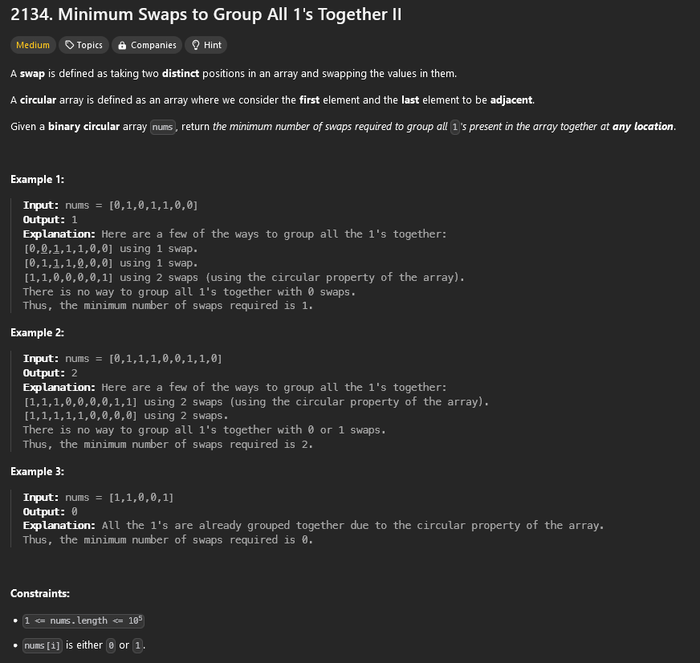

## Soru


## Çözüm

Bizden sorudan istenen, dairesel bir dizide tüm `1` leri tek bir grup halinde toplamak için en az kaç swap(kast ettiği yana kaydırma) sayısı(veya hareketi idk) yaptığını bulmamızı istemektedir. Bu dizide, ilk ve son elemanlar bitişik olarak kabul ettiğini söylemiştir(ss te bulunan 3. örnekte gördüğünüz gibi). 

# Dizi:
- Dizi, `0` ve `1` değerlerinden oluşmaktadır ve dairesel bir yapıya sahiptir.
- İlk ve son elemanlar bitişik kabul edilir(yine örnek olarak örnek 3).

# Dizi Örneği:
`nums = [0, 1, 0, 1, 1, 0, 0]` dizisinde, `1` leri gruplayacak minimum swap sayısını bulmamız gerekiyor bunun için `1` swap ile `1` leri gruplayabiliriz yani sonuç olarak minimum swap sayısı `1` dir.

# Çözüm Açıklaması:

Yapacağımız sliding window kullanarak dairesel diziyi düz bir dizi gibi ele alıp ve bu düzleştirilmiş dizide `1` leri gruplayarak minimum swap sayısını bulmaya çalışmak olcak.

1. **Toplam `1` Sayısını Bulma**: İlk adımda dizideki toplam `1` sayısını buluyoruz.
2. **Diziyi Genişletme**: Dairesel yapıyı düzleştirmek için diziyi iki kez art arda ekliyoruz.
3. **Kaydırma Penceresi Kullanma**: Pencere boyutu olarak toplam `1` sayısını kullanıyoruz. Her pencere içindeki `0` sayısını sayıyoruz ve bu sayıyı minimize etmeye çalışıyoruz.
4. **Minimum `0` Sayısını Bulma**: Minimum `0` sayısını bulduğumuzda, swap sayısı bu `0` sayısına eşit olacaktır.

## C++ Kodu
```cpp
class Solution {
public:
    int minSwaps(vector<int>& nums) {
        int n = nums.size();
        int onesCount = 0;

        for (int num : nums) {
            if (num == 1) onesCount++;
        }

        if (onesCount == 0 || onesCount == n) return 0;

        vector<int> extended(nums.begin(), nums.end());
        extended.insert(extended.end(), nums.begin(), nums.end());

        int currentZeros = 0;
        int minSwaps = INT_MAX;

        for (int i = 0; i < onesCount; i++) {
            if (extended[i] == 0) currentZeros++;
        }

        minSwaps = currentZeros;

        for (int i = 1; i < n; i++) {
            if (extended[i - 1] == 0) currentZeros--;
            if (extended[i + onesCount - 1] == 0) currentZeros++;

            minSwaps = min(minSwaps, currentZeros);
        }

        return minSwaps;
    }
};
```