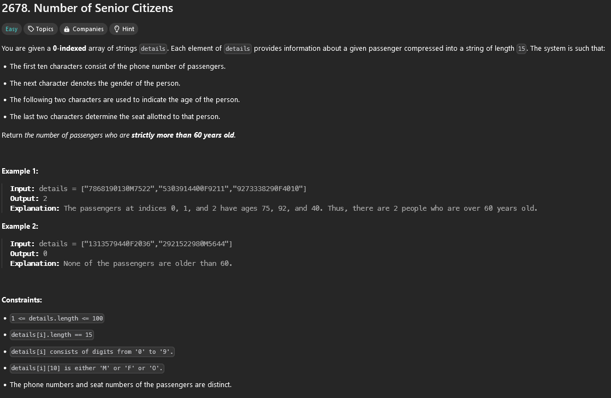

## Soru


## Çözüm
 
Bizden sorudan istenen, yolcu detaylarının bulunduğu bir diziden 60 yaşından büyük olan yolcuların sayısını bulmaamızı istemektedir.  Her yolcunun bilgisi string ve 15 karakterden oluşmaktadır.

# Yolcu Stringi:
- İlk 10 karakter yolcunun telefon numarası.
- İlk 11. karakter yolcunun cinsiyeti (lgbt+ şişman obez yok)
- İlk 12. ve 13. karakterler yolcunun yaşı.
- Son iki karakter ise yolcuya atanan koltuğun numarası.

# String örneği:
`details = ["7868190130M7522","5303914400F9211","9273338290F4010"]` dizisinde ilk yolcu 75, ikinci yolcu 92 ve üçüncü yolcu 40 yaşındadır yani sonuç olarak 2 yolcu 60 yaşından büyüktür.

# Çözüm Açıklaması:

Yapacağımız işlem her bir string de bulunan yaş bilgilerini çıkarıp 60 yaşından büyük olup olmadığını kontrol edip sonrasında kontrol edilenlere göre 60 yaşından büyük olan yolcuları saymak olucak.

1. **Başlangıç**: `count` değişkeni oluşturup 0 olarak atıyoruz. Bu değişkene 60 yaşından büyük olan yolcuların sayısını tutacağız.
2. **Döngü başlatıp inceleme**: `details` dizideki her bir string i tek tek inceleyeceğiz.
3. **Yaş bilgisini çıkartma**: Her stringde bulunan yaş bilgisini elde edebilmek için `substr` fonksiyonunu kullanacağız. `substr(11,2)` 1. parametreye 11 2. parametreye 2 değerini yazdıktan sonra string in 11. ve 12. karakterini almış olacağız.
4. **Integer dönüştürme**: Yaş stringini `stoi` fonksiyonu ile integer değerini dönüştürüyoruz.
5. **Karşılaştırma ve count a ekleme**: Eğer 60 yaşından büyükse, oluşturduğumuz `count` değişkenini bir artırıyoruz.
6. **Sonuç**: Döngü tamamlandıktan sonra `count` değişkenini döndürüyoruz ve 60 yaşından büyük yolcuların sayısına ulaşıyoruz.

## C++ Kodu
```cpp
class Solution {
public:
    int countSeniors(vector<string>& details) {
        int count = 0;
        for (const string& detail : details) {
            int age = stoi(detail.substr(11, 2));
            if (age > 60) {
                count++;
            }
        }
        return count;
    }
};
```