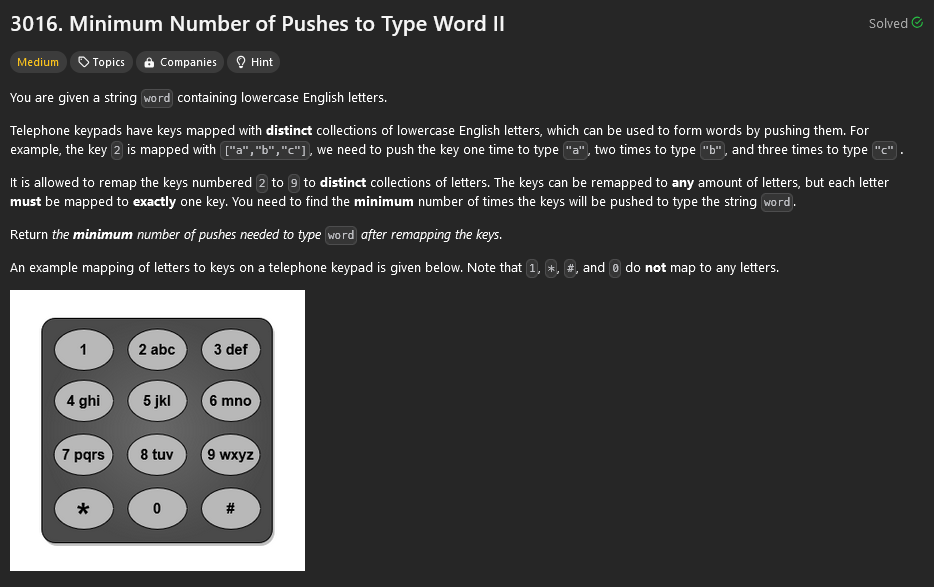
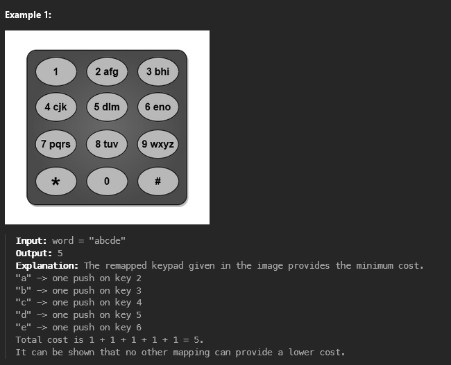
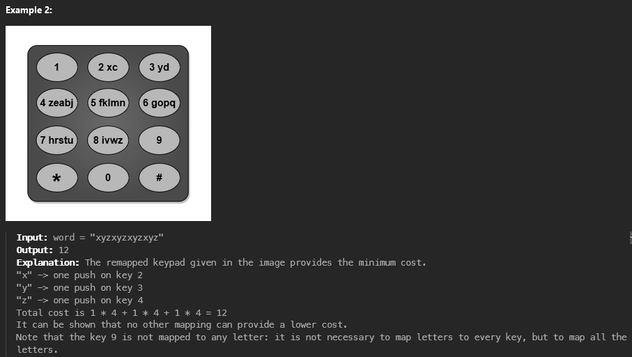
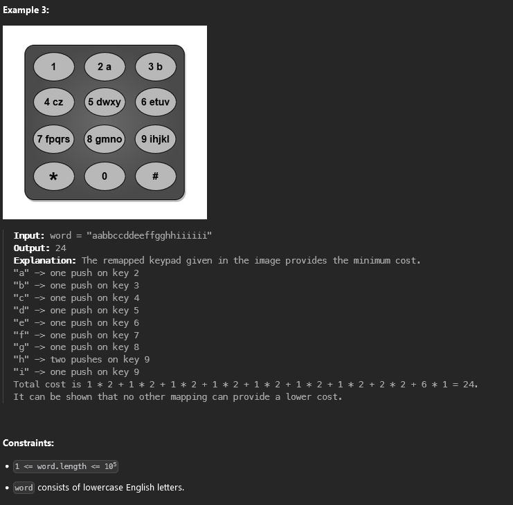

## Soru





## Çözüm

Biraz göz korkutan şekilde gözükse de yaspe bunu dener soru/problem bize "word" adı altında küçük harflerden oluşan bir dizi veriyor. Amacımız bu diziyi yazmak için gereken min basma sayısını bulmak bunun için de her harfi telefon tuşlarından min şekilde basacak şekilde yeniden işlemek olucak. Her tuş, bir grup harfi temsil eder ve harflerin sıklığına göre tuşları en verimli şekilde eşlemeye çalışcaz.

1. **Sıklığı Hesaplama:**  Verilen dizideki her harfin sıklığını(frekansını) hesaplıyoruz(her harfin ne kadar sık tekrarlandığını anlayacağız böylece). Misal word = "aabbccc" dizisinde 'a' iki kez, 'b' iki kez, ve 'c' üç kez tekrar ediyor.
2. **Sıklığı Sıralama:** En sık tekrar eden harflerin önce gelmesini yapabilmemiz için sıklıkları azalan sırayla sıralamamız gerekiyor böylece en yüksek frekansa sahip harfleri minimum basma sayısı gerektiren tuşlara yerleştirebiliriz. Misal 1 de verdiğim örnekte sıklıklar [3, 2, 2] olacaktır.
3. **Harfleri Tuşlara Dağıtma:** Her tuş 8 farklı harfi temsil edebilir o yüzden sıralı frekansları tuşlara yerleştirirken bir tuşta en fazla 8 harf bulunmasına gözümüzden kaçırmamız gerekiyor. Sıklıkları dikkate alarak harfleri tuşlara eşledikten sonra her tuş 8 harfi içerdiğinde bir sonraki tuş için basma sayısını artırmamız gerekiyor. Misal eğer en yüksek frekansta olan harfler a, b ve c ise ve ilk tuş 8 harf kapasitesine sahipse bu harfleri bu tuşa yerleştiriyoruz eğer daha fazla harf varsa kalan harfleri bir sonraki tuşa yerleştiriyoruz tuş başına basma sayısını "pushCount" olarak isimlendirdiğimiz değişkenle her 8 harften sonra bu değişkeni artırcak şekilde yapıyoruz.
4. **Toplam Basma Sayısını Hesaplama:** Harfleri tuşlara yerleştirdiğimizden sonra her harf için gereken basma sayısını hesaplamamız gerekiyor yani basma sayısı, her harfin sıklığı ile o harfi temsil eden tuşun basma sayısının çarpımıdır bu sayıları topladığımızda tüm diziyi yazmak için gereken toplam basma sayısını elde etmiş oluruz.

## C++ Kodu
```cpp
class Solution {
public:
    int minimumPushes(std::string word) {
        std::unordered_map<char, int> freq;
        
        // Harf frekanslarını hesaplıyoruz
        for (char c : word) {
            freq[c]++;
        }
        
        // Frekansları bir vektöre koyup azalan sırayla sıralıyoruz
        std::vector<int> frequencies;
        for (auto& entry : freq) {
            frequencies.push_back(entry.second);
        }
        
        std::sort(frequencies.rbegin(), frequencies.rend());
        
        // Harfleri tuşlara yerleştirip toplam basım sayısını hesaplaplıyoruz
        int totalPushes = 0;
        int pushCount = 1;  // Başlangıçta her harfi yazmak için gereken basma sayısı 1 olması gerekiyor
        int lettersOnCurrentKey = 0;
        
        for (int f : frequencies) {
            totalPushes += f * pushCount;  // Her harfi sırasıyla kaç kez basılacağını hesaplaplıyoruz
            lettersOnCurrentKey++;
            
            if (lettersOnCurrentKey == 8) {
                // Eğer mevcut tuş 8 harfi içeriyorsa bir sonraki tuş için basma sayısını artırıyoruz
                pushCount++;
                lettersOnCurrentKey = 0;  // Yeni tuş için harf sayısını sıfırlıyoruz
            }
        }
        
        return totalPushes;  // Ve sonuç toplam basma sayısını döndürüyoruz 
    }
};
```